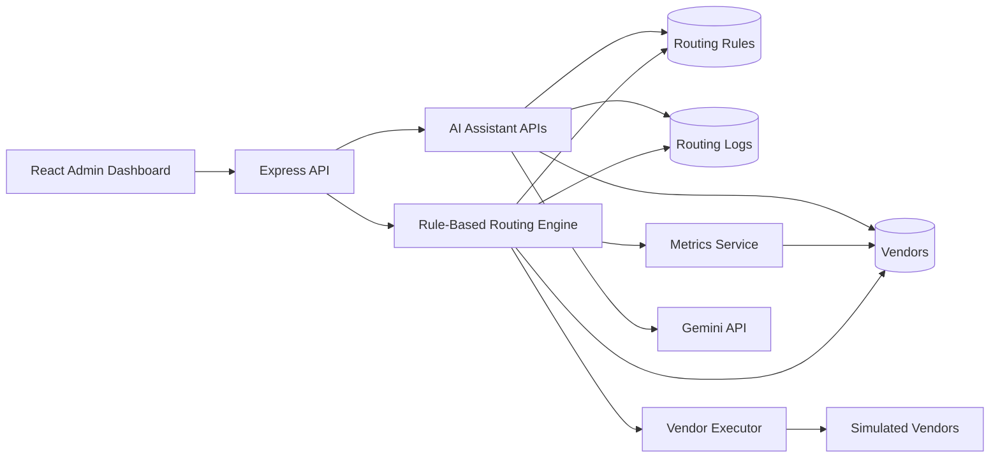
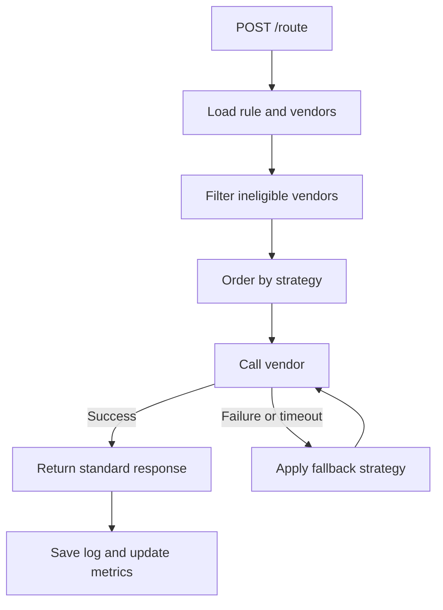

# Architecture

VendorSwitch has a React frontend and an Express/MongoDB backend. The frontend is only an admin console. The backend owns routing, metrics, logs, configuration, and AI helper APIs.

## System Diagram

Important: AI does not route requests. AI only helps admins generate rule configs, explain decisions, and analyze vendor health. Actual routing remains rule-based.

## Request Flow

## Routing Logic

For every request, the routing engine:

1. Loads vendors for the requested capability.
2. Skips vendors that are disabled, down, rate-limited, too slow, unhealthy, or missing required features.
3. Orders eligible vendors using the configured strategy.
4. Calls the first eligible vendor.
5. If that vendor fails or times out, applies fallback strategy and tries another vendor.
6. Saves request logs, attempted vendors, routing reason, latency, cost, and response.
7. Updates metrics and rate-limit usage.

Implemented strategies:

- Priority
- Weighted
- Lowest latency
- Lowest cost
- Failover
- Feature-based
- Health-based

## Main APIs

Mandatory APIs:

- `POST /vendors`
- `GET /vendors`
- `POST /route`
- `GET /vendor-metrics`
- `GET /routing-logs`
- `GET /health`

Extra APIs:

- `POST /routing-rules`
- `GET /routing-rules`
- `POST /ai/generate-rule`
- `POST /ai/explain-decision`
- `POST /ai/vendor-insight`

## Metrics and Logs

Metrics track:

- Average latency
- Success rate
- Error rate
- Availability
- Current rate-limit usage
- Remaining requests
- Rate-limited status

Routing logs store:

- `requestId`
- Capability
- Strategy
- Vendor used
- Status
- Routing reason
- Request payload
- Response payload
- Decision trace
- Attempted vendors

## AI Assistant

The AI Assistant supports the 5-mark bonus only. It is not part of the routing decision path.

It can:

- Generate routing configuration from plain English.
- Explain why a vendor was selected from routing logs.
- Analyze vendor health and suggest operational action.

The Gemini key is stored only in `server/.env` as `GEMINI_API_KEY`. The React frontend never exposes the key.

## Important Files

- `server/src/services/routingEngine.js` - routing, fallback, and decision logging.
- `server/src/services/metricsService.js` - metrics and rate-limit calculation.
- `server/src/services/vendorExecutor.js` - simulated vendor calls.
- `server/src/services/aiService.js` - Gemini AI helper logic.
- `server/src/models/Vendor.js` - vendor config and health.
- `server/src/models/RoutingRule.js` - strategy, fallback, and thresholds.
- `server/src/models/RequestLog.js` - routing logs and attempted vendors.
- `client/src/pages/RouteRequest.jsx` - route demo page.
- `client/src/pages/Vendors.jsx` - vendor management.
- `client/src/pages/RoutingRules.jsx` - rule management.
- `client/src/pages/AiAssistant.jsx` - AI assistant page.

## Simulation Note

Real third-party vendors are not used in this assignment. `vendorExecutor.js` simulates latency, timeout, success, and failure so routing, failover, metrics, and logs can be tested locally.
