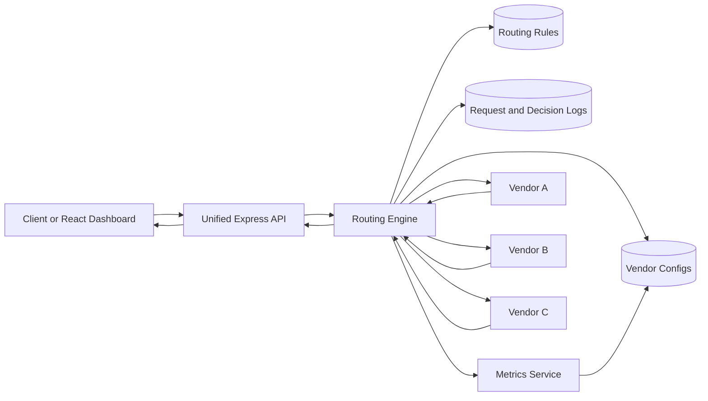
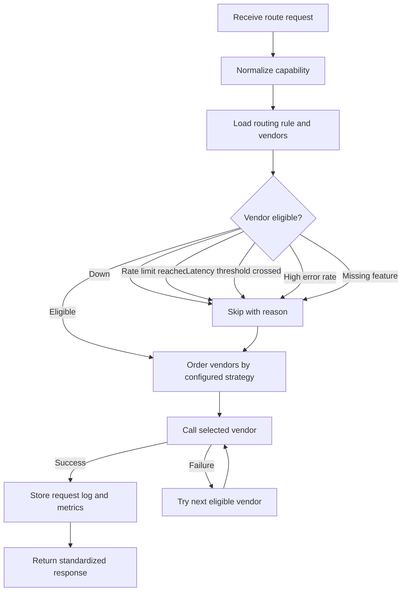

# Architecture

## High-Level Flow

The client only calls `/route`. It does not know which vendor was selected.

## Routing Decision Flow

## How Vendors Are Selected

1. Load all vendors for the requested capability.
2. Remove vendors that are disabled, down, rate-limited, above latency threshold, above error threshold, below availability threshold, or missing required features.
3. Order the remaining vendors using the configured strategy.
4. Call the first eligible vendor.
5. If the call fails or times out, try the next eligible vendor.
6. Store the request ID, request log, attempted vendors, routing reason, latency, cost, status, and response.
7. Update rate-limit usage from every attempted vendor call, including failed and timed-out attempts.
8. Update vendor health from recent attempts. High latency can mark a vendor as `DEGRADED`, and latency at or above timeout can mark it `DOWN`.

## Important Files

- `server/src/services/routingEngine.js`: routing strategy and failover logic
- `server/src/services/metricsService.js`: rate-limit and health metric calculations
- `server/src/services/vendorExecutor.js`: simulated vendor execution
- `server/src/models/Vendor.js`: vendor config and health data
- `server/src/models/RoutingRule.js`: strategy and thresholds
- `server/src/models/RequestLog.js`: routing decision logs

## Why Simulation Mode Is Used

The assignment focuses on routing design, failover, metrics, and logs. Real third-party KYC vendors are not available for this task, so `vendorExecutor.js` simulates latency, timeout, success, and failure behavior using each vendor's configured health profile.
