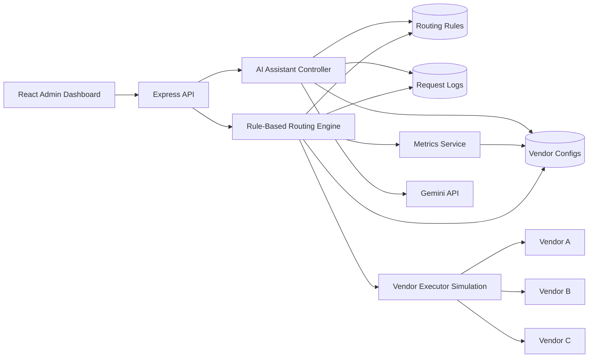
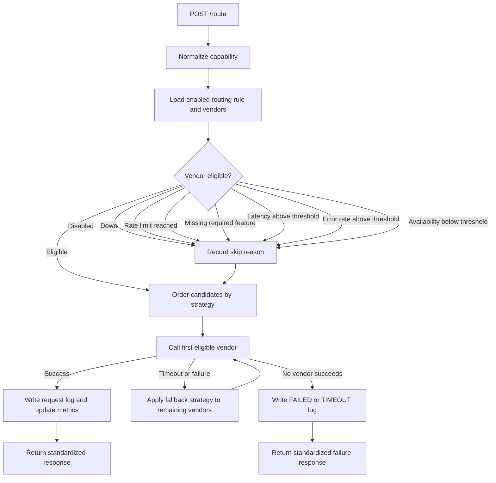
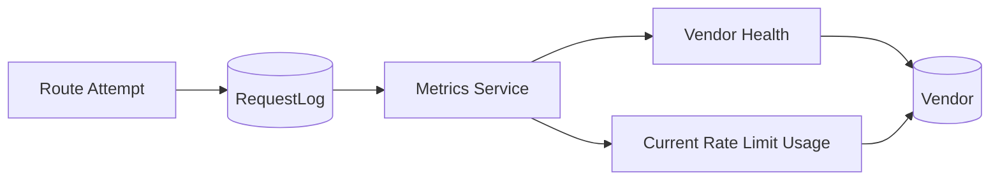
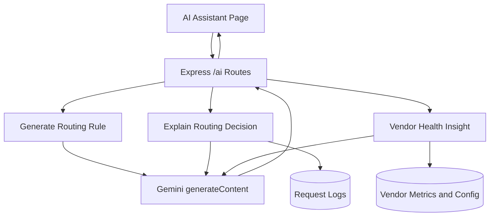

# Architecture

## System Overview

VendorSwitch is a MERN-based intelligent vendor routing platform. The React dashboard is used by administrators to configure vendors, routing rules, test route requests, inspect metrics, review logs, and use the optional AI Assistant. The actual routing decision is always made by the rule-based routing engine in the Express backend.

Important boundary: the AI Assistant does not route requests. It only helps administrators generate rule suggestions, explain logged decisions, and analyze vendor health. `/route` continues to use deterministic rule/config logic.

## Frontend Pages

- `Dashboard`: overview cards, current rules, recent routing decisions.
- `Vendors`: create/update vendors and enable or disable existing vendors.
- `Routing Rules`: create/update rules and enable or disable existing rules.
- `Route Request`: demo the unified `/route` API and show decision trace.
- `Metrics`: live vendor health, latency, success rate, error rate, availability, and rate-limit usage.
- `Logs`: routing decision history with request payload, response payload, decisions, and attempted vendors.
- `AI Assistant`: admin support page for rule generation, decision explanation, and vendor health insights.

## Routing Decision Flow

The client receives a standard response and does not need to know which vendor was considered or skipped unless it is inspecting the dashboard decision trace.

## Implemented Routing Strategies

The routing engine supports all seven strategies used in the UI and samples:

- `priority`: lower priority number wins first.
- `weighted`: vendors are ordered probabilistically using configured weight.
- `lowest_latency`: lowest current average latency wins first.
- `lowest_cost`: lowest cost per request wins first.
- `failover`: priority-style ordering with retry across eligible vendors.
- `feature_based`: vendors with better required-feature coverage are preferred.
- `health_based`: vendors are ranked using availability, error rate, and latency.

Each rule also has a `fallbackStrategy`. If the first selected vendor times out or fails during execution, the remaining vendors are reordered by fallback strategy and retried.

## Vendor Eligibility Rules

Before ordering vendors, the routing engine removes vendors that should not be called:

1. Vendor is disabled.
2. Vendor health status is `DOWN`.
3. Current rate-limit window is exhausted.
4. Vendor does not support all required features.
5. Vendor average latency is above request/rule threshold.
6. Vendor error rate is above rule threshold.
7. Vendor availability is below rule threshold.

Every skip reason is stored in the decision log so the UI can explain why a vendor was not selected.

## Metrics and Logs

Metrics are calculated from recent request logs and attempted vendors:

- `avgLatencyMs`
- `successRate`
- `errorRate`
- `availability`
- `rateLimit.currentUsage`
- `rateLimit.remaining`
- `rateLimit.isLimited`

Failed and timed-out attempted vendor calls also count toward rate-limit usage because the vendor was still called.

Each `RequestLog` stores:

- `requestId`
- capability
- strategy
- vendor used
- status: `SUCCESS`, `FAILED`, `TIMEOUT`, or `NO_VENDOR_AVAILABLE`
- routing reason
- latency and cost
- request payload
- response payload
- decision list
- attempted vendor list

## AI Assistant Flow

AI features:

- `POST /ai/generate-rule`: converts plain-English admin instructions into a routing-rule JSON suggestion.
- `POST /ai/explain-decision`: explains a stored request log in operational language.
- `POST /ai/vendor-insight`: recommends action based on vendor health.

Security and responsibility boundaries:

- Gemini API key stays only in `server/.env` as `GEMINI_API_KEY`.
- React never stores or exposes the API key.
- If Gemini is unavailable, deterministic fallback text/config is returned.
- AI suggestions are recommendations only; the routing engine remains rule-based.

## API Surface

Mandatory APIs:

- `POST /vendors`
- `GET /vendors`
- `POST /route`
- `GET /vendor-metrics`
- `GET /routing-logs`
- `GET /health`

Additional config and AI APIs:

- `POST /routing-rules`
- `GET /routing-rules`
- `POST /ai/generate-rule`
- `POST /ai/explain-decision`
- `POST /ai/vendor-insight`

## Important Files

- `client/src/pages/Vendors.jsx`: vendor configuration UI.
- `client/src/pages/RoutingRules.jsx`: routing-rule configuration UI.
- `client/src/pages/RouteRequest.jsx`: unified route-request tester.
- `client/src/pages/Metrics.jsx`: vendor metrics page.
- `client/src/pages/Logs.jsx`: decision-log page.
- `client/src/pages/AiAssistant.jsx`: optional AI assistant UI.
- `server/src/services/routingEngine.js`: routing, eligibility, strategy ordering, fallback, and logging.
- `server/src/services/metricsService.js`: rate-limit usage and health metric calculations.
- `server/src/services/vendorExecutor.js`: simulated vendor execution.
- `server/src/services/aiService.js`: Gemini integration and AI fallbacks.
- `server/src/models/Vendor.js`: vendor config, health, and rate-limit model.
- `server/src/models/RoutingRule.js`: strategy, fallback, thresholds, and enabled state.
- `server/src/models/RequestLog.js`: routing decision logs and attempted vendors.
- `sample-configs/sample-vendors.json`: six sample vendors.
- `sample-configs/sample-routing-rule.json`: routing rule examples covering all seven strategies.
- `sample-configs/sample-route-request.json`: route request examples and expected outputs.
- `sample-configs/sample-ai-prompts.md`: AI Assistant prompt examples.
- `sample-requests/api-samples.http`: concise mandatory API request samples.

## Why Simulation Mode Is Used

The assignment evaluates routing design, failover, metrics, logging, and configuration. Real third-party KYC/OCR/SMS vendors are not available for this task, so `vendorExecutor.js` simulates latency, timeout, success, and failure using each vendor's configured health profile. This keeps the routing engine realistic while making the project easy to run locally.
